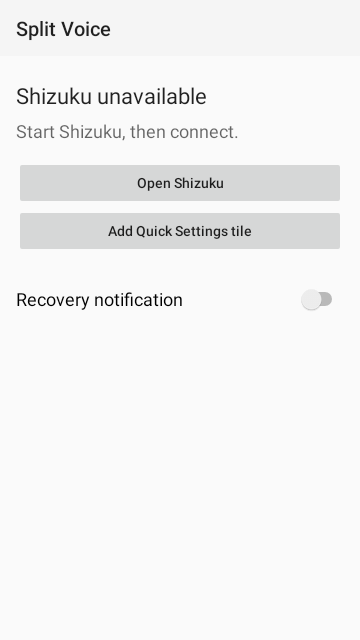

# Split Voice

Use a wireless microphone's receiver for voice input while listening through Bluetooth LE headphones. Toggle it from Android Quick Settings, with Shizuku and no root.



## Requirements

- Android 12 or later
- A microphone connected through its physical receiver
- Headphones with LE Audio enabled
- [Shizuku](https://shizuku.rikka.app/download/) running through [wireless debugging](https://shizuku.rikka.app/guide/setup/)

## Install

Download the `split-voice-development` artifact from a successful [CI run](https://github.com/meatcar/split-voice/actions/workflows/check.yml), extract it, and open the APK on your phone. You can also [build it yourself](#build).

Open Split Voice, tap **Connect**, and grant Shizuku access. Tap **Add Quick Settings tile**. On Android 12, add the tile manually from the Quick Settings editor.

Shizuku needs to be started again after a phone reboot. The optional recovery notification provides a shortcut back to Split Voice.

## Use

1. Connect your receiver and LE headphones, then start your voice app.
2. Tap **Split Voice** in Quick Settings to use the receiver microphone and headphone output.
3. End the voice session, then tap the tile again to restore normal routing.

Long-press the tile to open the app. If it shows **Recovery required**, stop the voice session, reconnect Shizuku, and tap **Restore**. Restore before uninstalling or clearing app data.

Split Voice changes Android's audio routing. It does not record audio or require microphone permission.

## Build

On Linux with [Nix](https://nixos.org/download/):

```sh
git clone https://github.com/meatcar/split-voice.git
cd split-voice
nix develop -c ./check
```

The APK is at `app/build/outputs/apk/debug/app-debug.apk`. See [CONTRIBUTING.md](CONTRIBUTING.md) for development instructions.

## Disclaimer

Split Voice uses Android's hidden audio APIs and changes system-wide routing; compatibility varies by device and Android version.

## Credits and license

Inspired by [BTMicFix](https://github.com/Endda/BTMicFix) by Endda. Built with [Shizuku](https://shizuku.rikka.app/) and [meatcar/nix-templates](https://github.com/meatcar/nix-templates).

By [Denys](https://denys.me). Licensed under [Apache-2.0](LICENSE). Dependency notices are in [THIRD_PARTY_NOTICES](THIRD_PARTY_NOTICES).
